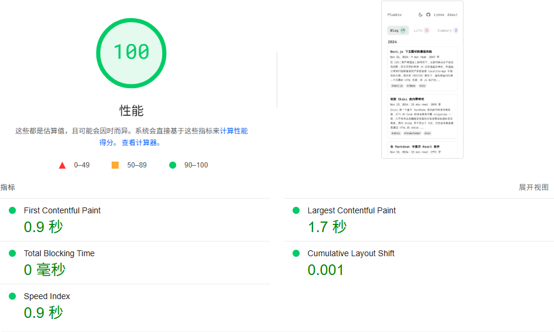
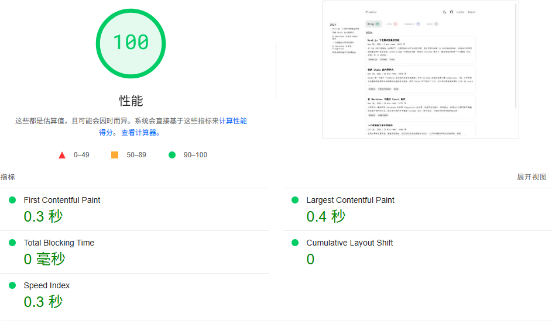

# [Plumbiu's blog](https://blog.plumbiu.top/)

<p>
  <a href="/README.md">简体中文</a>
  |
  <a href="/README-en.md">English</a>
</p>

感谢 [fuwari](https://github.com/saicaca/fuwari) 的样式。

<details>

<summary>性能分析</summary>

**移动端：**


**PC 端：**


</details>

# Features

- SSG 渲染，页面首次加载 JavaScript 只有 123kB（大多都是 [React][]）。
- markdown 扩展由 [remark][] 和 [rehype][] 插件支持。
- 静态代码高亮（客户端不引入 shiki），by [shiki][]。
- 亮色/暗色主题，by [persistent storage][]、[system theme listener][]。
- 图片优化，blurhash 支持，by [sharp][]、[next/image][]。
- 评论系统，by [Gtihub API][]。
- 自定义组件懒加载，by [IntersectionObserver][]。

# 自定义

markdown 拓展配置可看文章 [Markdown extensions](https://blog.plumbiu.top/posts/note/custom-component)。

## 页面信息

页面信息配置文件在 [config/site.ts](/config/site.ts) 文件中，删除某个变量时，记得删除引用该变量的代码。

## 文章

文章文件在 [posts](/posts/) 文件夹中，其子目录表示类别（`Categories`），如果想要删除某些类别，请同时修改 [data/constants/categories.ts](/data/constants/categories.ts) 文件。

### front-matter

front-matter 至少包含标题以及发布时间:

```markdown
---
title: 文章标题
date: 文章发布时间
desc: 文章描述（可以是数字，表示描述为正文第几行的内容）
---
```

### i18n

i18n 目前支持不完善，但是你可以在各个分类目录中新建目录，例如 [posts/note/en](/posts/note/en) 目录，通过配置 [config/locale.ts](/config/locale.ts) 文件，文章列表可以显示对应的语言。

### 图片

图片地址默认携带前缀 `images`，意味着文件应存放在 [public/images](/public/images/) 文件夹中。

## Env 文件

示例文件： [.env.example](/.env.example)。

Env 文件主要用于评论，需要申请 Github App，具体登陆实现逻辑可以看阮一峰老师的文章 [Github OAuth](https://ruanyifeng.com/blog/2019/04/github-oauth.html)。

# 部署 Github pages

将文件 (./.github/workflows/nextjs.yml)[./.github/workflows/nextjs.yml] 取消注释并修改文件 [data/site.ts](/data/site.ts) 中 `RepoName` 变量。

> [!WARNING]
> Github pages 不支持 API 路由，所以评论会失效。

<!-- Definitions -->

[React]: https://github.com/facebook/react
[rehype]: https://github.com/rehypejs/rehype
[remark]: https://github.com/remarkjs/remark
[shiki]: https://github.com/shikijs/shiki
[persistent storage]: https://developer.mozilla.org/en-US/docs/Web/API/Window/localStorage
[system theme listener]: https://developer.mozilla.org/en-US/docs/Web/API/Window/matchMedia
[sharp]: https://github.com/lovell/sharp
[next/image]: https://nextjs.org/docs/basic-features/image-optimization
[Gtihub API]: https://docs.github.com/zh/rest
[remark-directive]: https://github.com/remarkjs/remark-directive
[IntersectionObserver]: https://developer.mozilla.org/en-US/docs/Web/API/IntersectionObserver
